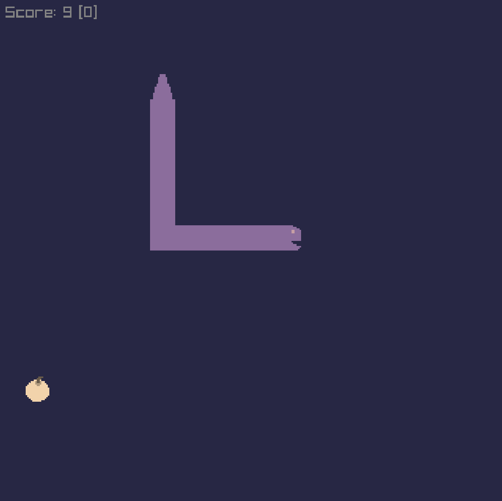

# Snake



This is a basic implementation of the classic Snake in Odin with Raylib.

## Requirements

- [odin](https://odin-lang.org/)
- [raylib](https://www.raylib.com/)
- [make](https://www.gnu.org/software/make/)

## Instructions

Eat them fruits.

- `enter` on the keyboard or the gamepad's `start` to (re)start the game
- `left/right/up/down` on the keyboard or the controller's `d-pad` or left joystick for navigation

## Release Builds

Can be found on the [Itch.io](https://dxtrs.itch.io/snake) game page.

## Running

```bash
make run
```

## Building

### Linux

```bash
make release-linux
```

### MacOS

```bash
make release-darwin
```

### Windows

```bash
release.bat
```
